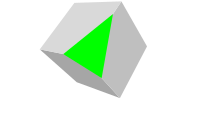
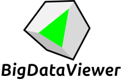
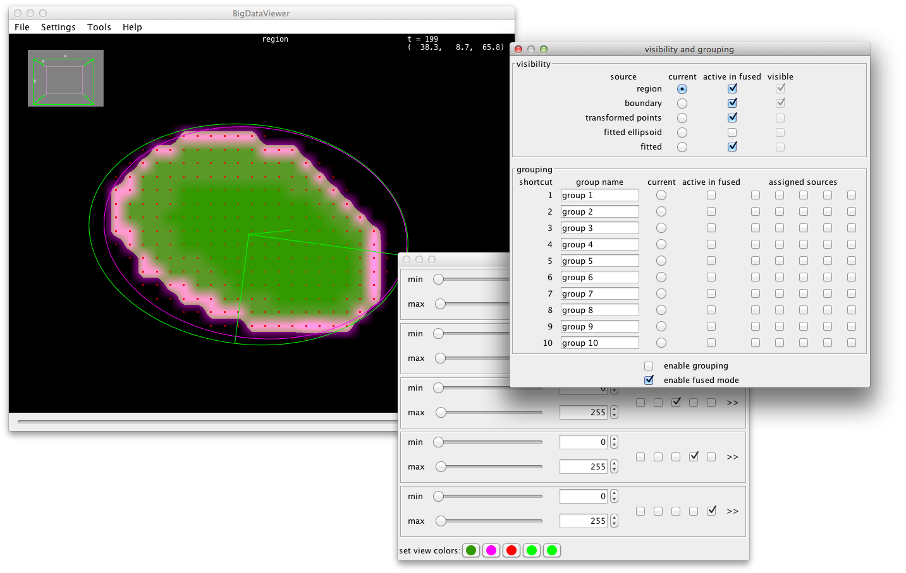

[](https://github.com/bigdataviewer/bigdataviewer-core/actions/workflows/build-main.yml)
[](https://imagesc.zulipchat.com/#narrow/stream/327326-BigDataViewer)

[](https://github.com/bigdataviewer/bigdataviewer-core#gh-dark-mode-only)
[](https://github.com/bigdataviewer/bigdataviewer-core#gh-light-mode-only)

ImgLib2-based re-slicing viewer for terabyte-sized multi-view image sequences.
See https://imagej.net/plugins/bdv for (somewhat out-dated) user documentation.

BigDataViewer is designed to be re-used as a visualization component in other software (besides being a stand-alone Fiji plugin).
Examples include [ABBA](https://abba-documentation.readthedocs.io), [BigStitcher](https://imagej.net/plugins/bigstitcher), [BigWarp](https://imagej.net/plugins/bigwarp), [Labkit](https://imagej.net/plugins/labkit), [MaMuT](https://imagej.net/plugins/mamut), [Mastodon](https://imagej.net/plugins/mastodon), [MoBIE](https://mobie.github.io), [Paintera](https://github.com/saalfeldlab/paintera).

# vistools

The best entry point for using BDV in your own project is the [BdvFunctions](https://github.com/bigdataviewer/bigdataviewer-core/blob/master/src/main/java/bdv/util/BdvFunctions.java) class.
A short introduction is below, and you can find a lot of short examples [here](https://github.com/bigdataviewer/bigdataviewer-core/tree/master/src/test/java/bdv/util).

## Usage

```
Random random = new Random();
Img<ARGBType> img = ArrayImgs.argbs(100, 100, 100);
img.forEach(t -> t.set(random.nextInt()));
Bdv bdv = BdvFunctions.show(img, "img");
```
creates a random 3D ARGB img and shows it in a BDV window.

All `BdvFunctions` methods will return some instance of `Bdv` which can be used to close the BDV window:
```
bdv.close()
```
or add more stuff to the same window:
```
BdvFunctions.show(img2, "img2", Bdv.options().addTo(bdv));
```
Via `bdv.getBdvHandle()` you can get access to the BDV `ViewerPanel` and `SetupAssignments` allowing more fine-grained
manipulations of BDV state.

The concrete `Bdv` instance returned from `BdvFunctions.show(img, "img")` in the above example is `BdvStackSource<ARGBType>` and
has additional methods, e.g., `removeFromBdv()` which removes `img` from the BDV window.

To display a 2D image, display a 3D image as a stack of 2D slices over time etc:
```
BdvFunctions.show(img2, "img2", Bdv.options().is2D());
```
The `is2D()` option is per Viewer window, not per stack. If it is set, the BDV navigation mouse and keybindings are set up for 2D, etc...

More fine-grained control can be achieved with `axisOrder()` option:
```
BdvFunctions.show(img2, "img2", Bdv.options().is2D().axisOrder(XYT))
```
`AxisOrder` specifies how the stack dimensions are interpreted.
For BDV with 3D navigation, the follwoing are useful: `XYZ, XYZC, XYZT, XYZCT, XYZTC`.
For BDV with 2D navigation, the following are useful: `XY, XYC, XYT, XYCT, XYTC`.
You should interpret `C` and `T` losely. The effect is that `T` will be mapped to the time slider of the BDV,
while `C` is mapped to BDV sources.
(This also means that you should not have images with a large `C` dimension.)

There is/will be stuff to add annotation overlays. Currently `BdvFunctions.showPoints()` is available.

Here is an example screenshot where several 3D stacks, a set of boundary points, and 3D ellipsoids fitted to the boundary points were added to a BDV window. It also shows how the usual BDV dialogs can be used to adjust visibility / brightness / colors of tbe individual sources.

