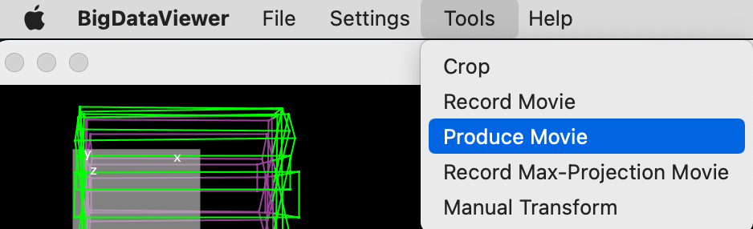
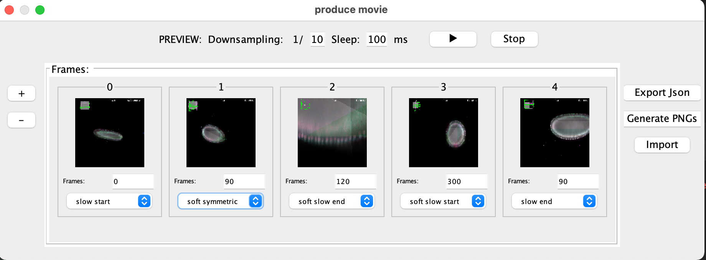

# bigdataviewer-core

 ImgLib2-based viewer for registered SPIM stacks and more
---
Feature added in this fork: **Interactive Video producing using Spline interpolation** 

### Install:
`$ ./install.sh`

### Run:
`$ ./bdv INPUT_PATH`

### How to use:

1- **Video producer panel** can be opened by clicking `F7` or via `Tools -> Produce Movie`

2- By opening Video Producer you get this panel

- `+` To add current frame
- `-` To delete last frame
- Preview with a frame down-sampling and sleep time between frames
- Accel: you select the interpolation: `Slow start` , `slow end` , `Symmetric` ...
- Export: Can be in `Json` or `PNG sequence`
- Import saved `Json`
=======

ImgLib2-based viewer for registered SPIM stacks and more

